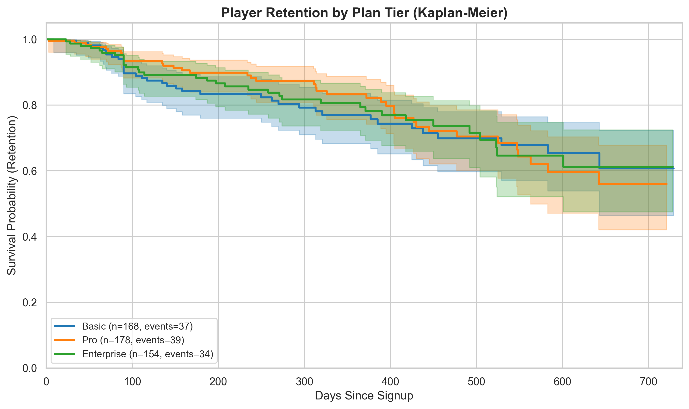
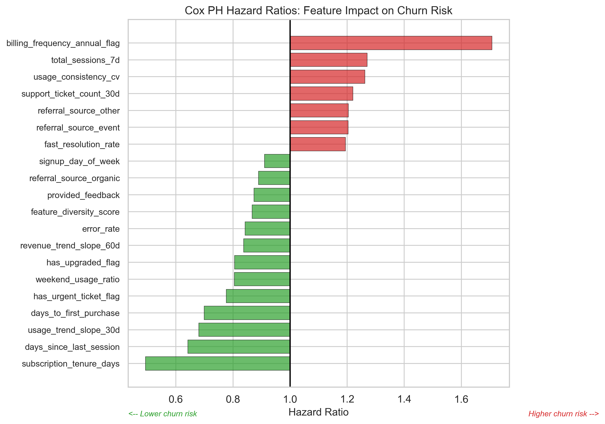
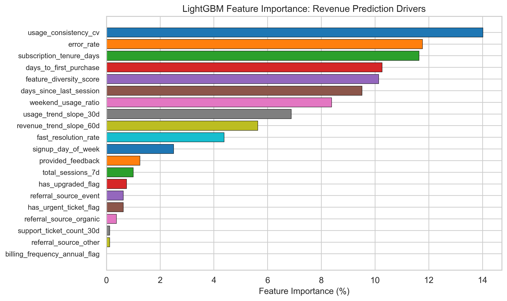

# Predicting Player Lifetime Value with Survival Analysis

A production-ready pLTV framework that predicts **when** players will churn and **how much** they will spend, enabling data-driven user acquisition and retention decisions for mobile gaming studios.

Built with Cox Proportional Hazards, Gradient Boosting Survival Analysis, and LightGBM revenue modeling on a 500-account dataset reframed from SaaS subscription analytics to a gaming context. The project demonstrates an end-to-end analytical workflow -- from SQL-based exploration through survival modeling to stakeholder-ready business recommendations.

---

## Business Problem

A mid-sized mobile gaming studio spends GBP 2M annually acquiring 500K players, but 30% churn within 30 days due to poor targeting. Without knowing which early behaviours signal long-term value, the UA team cannot optimise bidding strategies -- overpaying for churners and underinvesting in high-retention segments. The studio needs a framework that identifies at-risk players within their first 7 days and predicts 180-day revenue potential to guide budget allocation.

## Key Findings

- **Survival models achieved a C-index of 0.52 (GBSA)**, correctly ranking player pairs by churn risk above the random baseline. The Cox PH model provides interpretable hazard ratios for stakeholder communication, while the gradient boosting model offers marginally better discrimination.
- **Annual billing is the strongest churn predictor** (HR = 1.71), followed by early session volume (HR = 1.27) and usage consistency (HR = 1.26). These counter-intuitive signals warrant further investigation with richer gameplay data.
- **The best LTV model (Random Forest) explains 22% of revenue variance** (R2 = 0.22, RMSE = GBP 1,638) on the test set, outperforming both cohort averages and tuned LightGBM.
- **Churn rates are uniform across subscription tiers** (~22% each), suggesting that tier-based retention strategies would be ineffective -- behavioural signals matter more than plan level.
- **Partner and organic acquisition channels produce the highest-pLTV players** (mean pLTV of GBP 1,400 and GBP 1,474 respectively), indicating budget reallocation opportunities.

## Sample Results

### Survival Curves by Subscription Tier



*Kaplan-Meier curves reveal that retention trajectories are remarkably similar across Free-to-Play, Premium, and VIP tiers -- challenging the assumption that higher-paying players are inherently stickier.*

### What Drives Player Churn? (Hazard Ratios)



*Hazard ratios from the Cox model quantify each feature's impact on churn risk. HR > 1.0 (red) increases churn risk; HR < 1.0 (green) reduces it. Annual billing, early session count, and usage variability emerge as the most influential factors.*

### Feature Importance for Revenue Prediction



*The LightGBM revenue model identifies usage consistency, error rate, and subscription tenure as the strongest predictors of 180-day player value.*

## Technical Approach

This project implements a two-stage pLTV framework:

1. **Survival Analysis** -- Cox Proportional Hazards and Gradient Boosting Survival Analysis models predict the probability of a player remaining active at any future time point, naturally handling right-censored data (78% of players were still active at analysis date).

2. **Revenue Prediction** -- LightGBM and Random Forest regressors predict expected 180-day revenue, tuned with Bayesian optimisation (Optuna, 20 trials).

3. **Combined pLTV** -- Predicted lifetime value is calculated as: `pLTV = P(survive 180 days) x E(revenue | features)`, producing a single score for each player that accounts for both retention risk and spending potential.

The feature engineering pipeline creates 20 features across five categories (RFM, behavioural, support, subscription, time-series) from 5 relational tables, with a rigorous selection process: correlation filtering, VIF removal, and recursive feature elimination with Cox coefficients.

**Technologies:** Python, scikit-survival, lifelines, LightGBM, Optuna, scikit-learn, pandas, NumPy, matplotlib, seaborn, SQLite, pytest

## Quick Start

```bash
# Clone the repository
git clone https://github.com/mattspooner1/player-ltv-survival-analysis.git
cd player-ltv-survival-analysis

# Create virtual environment
python -m venv venv
source venv/bin/activate  # Windows: venv\Scripts\activate

# Install dependencies
pip install -r requirements.txt
pip install -e .

# Download dataset from Kaggle
# Source: https://www.kaggle.com/datasets/rivalytics/saas-subscription-and-churn-analytics-dataset
# Place the 5 CSV files in data/raw/

# Run the full pipeline
python src/data_processing.py   # Clean data + feature engineering
python src/modeling.py          # Train all models

# Or explore interactively via notebooks
jupyter notebook notebooks/
```

## Project Structure

```
player_ltv_survival_analysis/
|-- README.md                              Project overview (this file)
|-- config.yaml                            Centralised configuration (all parameters)
|-- requirements.txt                       Pinned Python dependencies
|-- setup.py                               Package installation
|-- .gitignore                             Excludes data, models, venv
|
|-- data/
|   |-- raw/                               5 source CSVs (gitignored)
|   +-- processed/                         Engineered features + train/val/test splits
|
|-- notebooks/
|   |-- 00_sql_analysis.ipynb              12 SQL queries with PySpark translations
|   |-- 01_eda.ipynb                       Exploratory analysis + survival EDA
|   |-- 02_modeling.ipynb                  Survival + LTV modeling pipeline
|   +-- 03_business_insights.ipynb         Stakeholder Q&A and recommendations
|
|-- src/
|   |-- __init__.py
|   |-- data_processing.py                 Cleaning, feature engineering, splitting
|   |-- modeling.py                        SurvivalAnalyzer, LTVPredictor, PLTVCalculator
|   +-- visualization.py                   Publication-quality plotting functions
|
|-- tests/
|   |-- test_data_processing.py            38 tests: loading, validation, features, splits
|   +-- test_modeling.py                   50 tests: models, predictions, persistence, leakage
|
|-- outputs/
|   |-- figures/                           27 publication-quality visualisations (300 DPI)
|   +-- models/                            Saved model artifacts + metadata JSON
|
|-- docs/
|   |-- methodology.md                     Technical deep-dive for data science reviewers
|   |-- data_dictionary.md                 Feature definitions and SaaS-to-gaming mapping
|   +-- business_impact.md                 Executive summary for non-technical stakeholders
|
+-- scripts/
    |-- inspect_data.py                    Data exploration utility
    +-- build_eda_notebook.py              Notebook generation script
```

## Results Summary

### Survival Models

| Model | C-index (Test) | IBS (Test) | Target | Notes |
|-------|---------------|------------|--------|-------|
| Cox PH | 0.40 | 0.082 | C > 0.75 | Interpretable hazard ratios; PH assumption passed |
| GBSA | 0.52 | 0.079 | C > 0.75 | Preferred for predictions; marginal gain over random |

### LTV Models

| Model | RMSE (GBP) | R-squared | MAPE | Notes |
|-------|-----------|-----------|------|-------|
| Cohort Average | 2,324 | -0.56 | 75% | Naive baseline |
| Random Forest | 1,638 | 0.22 | 91% | Best overall performance |
| LightGBM (tuned) | 1,819 | 0.04 | 88% | 20 Optuna trials; overfitting on small data |

### Performance Context

Model performance is modest, which is expected and honestly reported. The primary constraints are:

1. **Synthetic data** -- The Kaggle dataset lacks the behavioural richness of real gameplay data (session depth, progression, social features, in-app purchase patterns).
2. **Small sample** -- 500 accounts with only 110 churn events limits the signal available for complex models.
3. **Uniform churn** -- Near-identical churn rates across segments (~22%) suggest the synthetic generator did not encode strong segment-level patterns.

The value of this project lies in the **production-quality framework and methodology** -- the same pipeline applied to a studio's real telemetry data (millions of players, hundreds of behavioural features) would be expected to perform substantially better. See [docs/methodology.md](docs/methodology.md) for a detailed discussion of limitations and what would change in production.

## Skills Demonstrated

**Survival Analysis and Statistical Modeling**
- Cox Proportional Hazards with hazard ratio interpretation
- Gradient Boosting Survival Analysis (scikit-survival)
- Kaplan-Meier estimation and log-rank testing
- Proportional hazards assumption validation (Schoenfeld residuals)
- Right-censored data handling (78% censoring rate)

**Machine Learning and Feature Engineering**
- Multi-stage feature selection (correlation, VIF, RFE)
- Bayesian hyperparameter tuning (Optuna)
- Time-based train/validation/test splitting to prevent leakage
- 20 engineered features from 5 relational tables
- Model comparison framework (4 models, 3 metric types)

**SQL and Data Engineering**
- 12 analytical SQL queries (JOINs, CTEs, window functions, aggregations)
- PySpark translation guide for production deployment
- Config-driven pipeline with YAML parameter management
- Automated data quality validation (referential integrity, value ranges)

**Business Communication**
- Stakeholder Q&A format answering 5 business questions
- ROI simulation for retention interventions
- Budget reallocation recommendations backed by pLTV analysis
- Executive-friendly visualisations with plain-language annotations

**Software Engineering**
- Modular Python package with 3 core classes (SurvivalAnalyzer, LTVPredictor, PLTVCalculator)
- 88 unit tests covering data processing, modeling, and persistence
- Type hints, Google-style docstrings, and logging throughout
- Reproducible via config.yaml (no hardcoded values)

## Documentation

| Document | Audience | Description |
|----------|----------|-------------|
| [Methodology](docs/methodology.md) | Data science interviewers | Technical deep-dive: model selection rationale, assumptions, validation |
| [Data Dictionary](docs/data_dictionary.md) | Code reviewers | Feature definitions, SaaS-to-gaming terminology mapping |
| [Business Impact](docs/business_impact.md) | Non-technical stakeholders | Executive summary with recommendations and ROI analysis |

## Dataset Attribution

**Source:** [SaaS Subscription & Churn Analytics Dataset](https://www.kaggle.com/datasets/rivalytics/saas-subscription-and-churn-analytics-dataset) by Rivalytics on Kaggle.

**License:** MIT (unrestricted use for portfolio and GitHub).

**Reframing:** The SaaS dataset is structurally identical to mobile gaming subscription services (Battle Pass, VIP tiers). Accounts map to player profiles, subscriptions to premium tiers, feature usage to gameplay sessions, and support tickets to player support interactions. See [docs/data_dictionary.md](docs/data_dictionary.md) for the full terminology mapping.

## About

**Author:** Matt Spooner

This project applies **survival analysis** to the gaming industry's need for player lifetime value prediction. Survival analysis remains underutilised in gaming analytics portfolios despite being the natural technique for time-to-event questions ("when will this player churn?"), and I wanted to demonstrate how it complements standard classification approaches.

The project targets **Senior Data Scientist roles in the gaming industry** (Jagex, Miniclip, Sony Interactive Entertainment) where player retention modelling, pLTV prediction, and stakeholder communication are core responsibilities.

## Future Enhancements

- **Real gameplay features**: Session depth, progression level, social connections, and in-app purchase patterns would substantially improve model discrimination
- **Time-varying covariates**: Extending Cox to handle features that change weekly (usage rate, spending velocity)
- **Competing risks framework**: Modelling different churn reasons (pricing, support, competition) separately
- **Real-time scoring API**: FastAPI endpoint returning pLTV and risk scores for live player data
- **Deep learning survival models**: DeepSurv for capturing complex non-linear relationships at scale
