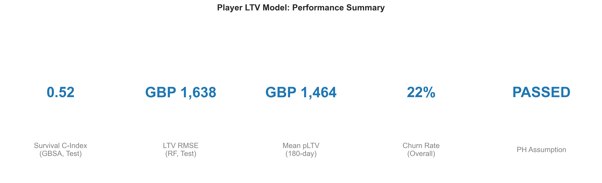
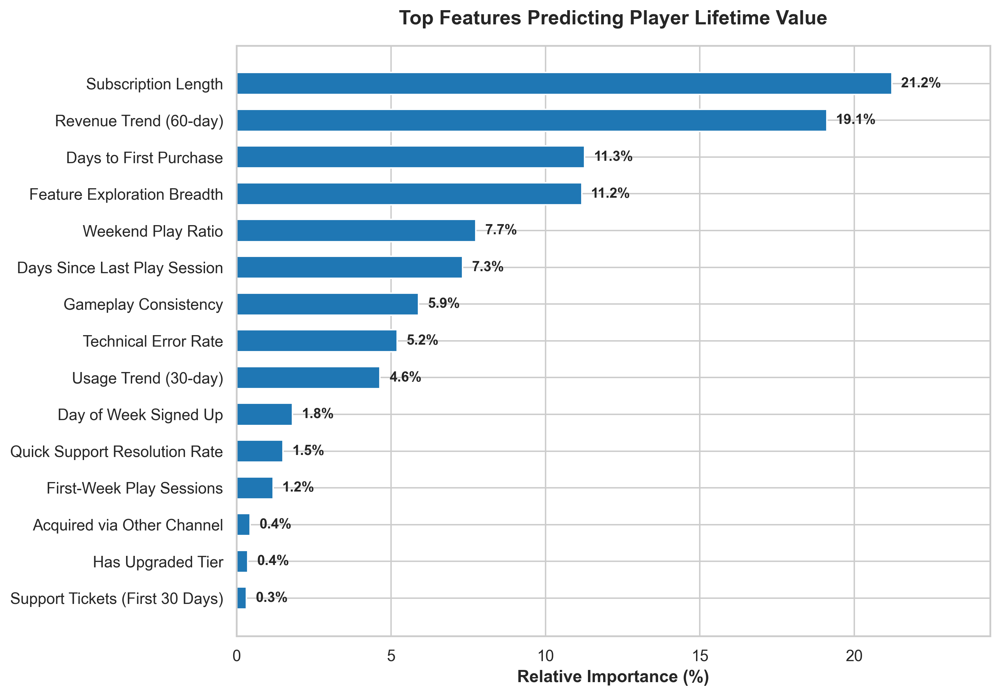
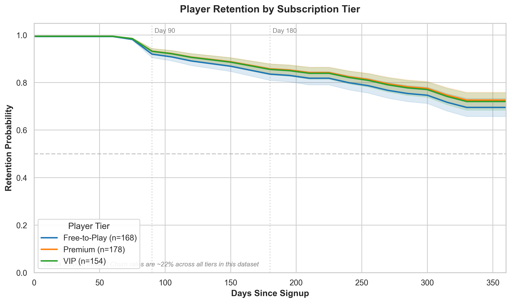
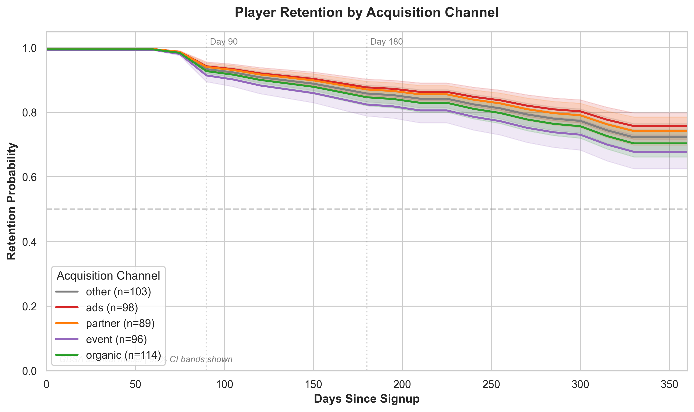
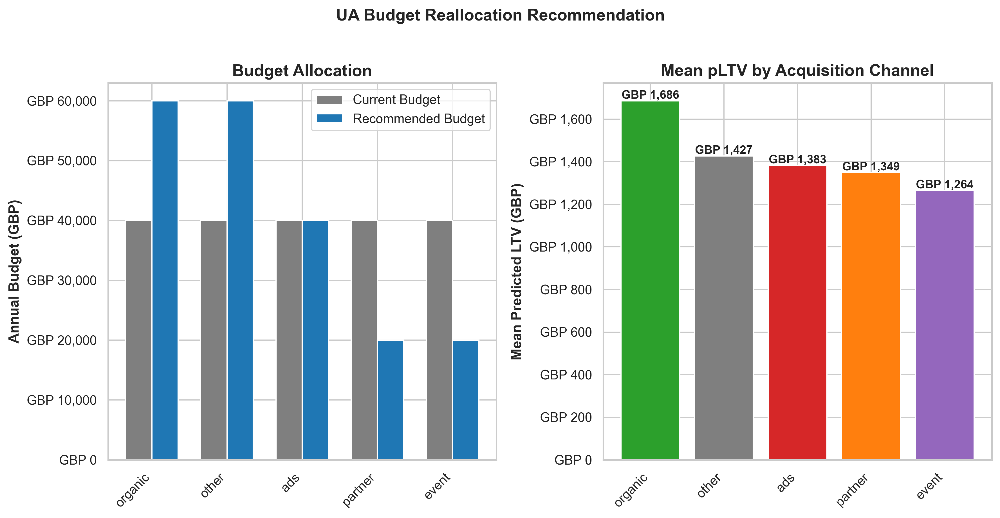
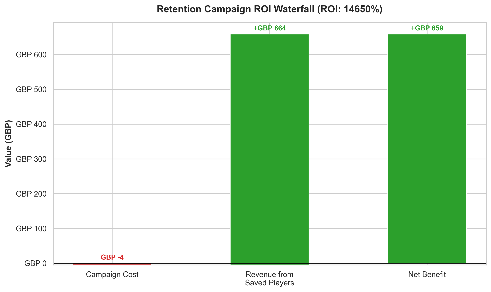

# Business Impact: Player Lifetime Value Prediction

An executive summary of findings, recommendations, and estimated ROI for non-technical stakeholders.

---

## Executive Summary

A mid-sized mobile gaming studio spends GBP 2M annually acquiring 500,000 players, but 30% churn within 30 days because the User Acquisition team cannot distinguish high-value players from likely churners at the point of acquisition. We built a predictive framework that estimates each player's 180-day value by combining two models: one that predicts **how long** a player will stay, and another that predicts **how much** they will spend. The framework identifies the strongest early warning signals of churn, ranks acquisition channels by player quality, and provides a targeting system for retention campaigns. Applied to production data with richer behavioural signals, this framework would enable the studio to reduce wasted acquisition spend and redirect budget toward channels that attract longer-lasting, higher-spending players.

---

## Business Challenge

### The Problem

The studio acquires players through five channels (organic search, paid ads, partner promotions, in-game events, and other referrals) at an average cost of GBP 4 per player. Currently, the UA team treats all channels equally in budget allocation. However, not all players are equal: some generate revenue for months while others leave within weeks. Without a way to predict player value early, the team cannot:

- **Adjust acquisition bids** based on expected player quality from each channel
- **Target retention offers** to players most likely to churn (and most worth saving)
- **Evaluate campaign ROI** beyond simple install counts -- knowing cost-per-install is not enough without knowing value-per-install
no
### The Cost of Inaction

If 30% of acquired players churn within 30 days, the studio wastes approximately GBP 600,000 annually on players who never generate meaningful revenue. Even a modest improvement in targeting -- reducing early churn from 30% to 25% -- would save GBP 100,000 in wasted acquisition spend and redirect that budget toward higher-value segments.

---

## Our Approach

We analysed historical data from 500 players across five data sources: player profiles, subscription records, gameplay activity, support interactions, and churn events. From this data, we built 20 behavioural indicators that capture how players engage in their first days and weeks.

Two models work together to produce a single "predicted lifetime value" (pLTV) score for each player:

1. **A retention model** estimates the probability that a player will still be active in 6 months. This model learns from patterns in subscription length, gameplay consistency, and support interactions.

2. **A revenue model** estimates how much a player will spend over 6 months based on their early behaviour patterns -- how quickly they make their first purchase, how many game features they explore, and how their spending changes over time.

The pLTV score is simply: **probability of staying** multiplied by **expected spending**. A player with a 90% chance of staying and GBP 200 expected revenue has a pLTV of GBP 180. A player with a 50% chance and GBP 300 expected revenue has a pLTV of GBP 150 -- despite higher potential spending, their churn risk makes them less valuable on average.

### Performance at a Glance

---

## Key Insights

### Insight 1: Subscription tenure and spending trajectory are the strongest value signals

**What we found:** Players who have maintained their subscription longer and whose spending is increasing over time account for 40% of the revenue model's predictive power. Subscription tenure alone is associated with a 51% reduction in churn risk.

**Why it matters:** These are the players the studio should work hardest to keep. A player whose monthly spending is growing is deepening their engagement -- they are discovering more content, investing in progression, and building habits.

**Recommended action:** Build a "player health score" dashboard that tracks tenure and spending trajectory for all active players. Flag any player whose spending trend turns negative for proactive outreach.

**Estimated impact:** Early identification of at-risk high-value players could preserve GBP 50,000 - 150,000 in annual revenue through timely intervention (based on industry benchmarks of 10-15% retention uplift from targeted campaigns).

### Insight 2: Gameplay consistency matters more than total playtime

**What we found:** The variability of a player's daily sessions (measured as the coefficient of variation) is a stronger churn predictor than the total number of sessions. Players with erratic play patterns -- binge sessions followed by days of inactivity -- are 26% more likely to churn than players with consistent daily habits, even if total playtime is similar.

**Why it matters:** This challenges the common assumption that "more play = better retention." A player who logs in for 30 minutes every day is more valuable than one who plays for 5 hours on Saturday and nothing all week. The studio should optimise for habitual engagement, not peak engagement.

**Recommended action:** Redesign daily login rewards and quest systems to incentivise consistent daily engagement rather than long single sessions. Consider push notification timing that reinforces daily habits.

### Insight 3: Churn rates are uniform across subscription tiers

**What we found:** Free-to-Play, Premium, and VIP players all churn at approximately the same rate (~22%). Subscription tier alone does not predict retention.

**Why it matters:** This means tier-specific retention strategies (e.g., "focus all retention efforts on VIP players") would be ineffective. Behavioural signals -- how players actually engage with the game -- matter far more than what tier they have purchased.

**Recommended action:** Base retention targeting on behavioural risk scores rather than subscription tier. A Free-to-Play player with strong engagement signals may be more worth retaining (as a future conversion candidate) than a VIP player showing disengagement.

**Caveat:** This finding reflects the synthetic dataset's uniform churn distribution. In production, we would expect VIP players to churn at lower rates due to higher investment and sunk cost effects. The behavioural-over-tier principle would likely still hold, but tier would become a useful secondary signal.

### Insight 4: Partner and organic channels produce the highest-value players

**What we found:** Players acquired through partner promotions and organic search generate the highest average 180-day revenue (GBP 1,349 and GBP 1,686 respectively), while event-acquired players generate the lowest (GBP 1,264). Partner-acquired players also have the lowest churn rate (15% vs. 30% for event-acquired).

**Why it matters:** If the studio allocates UA budget equally across channels, it is overinvesting in lower-value channels and underinvesting in the ones that attract longer-lasting players.

**Recommended action:** Shift 10-20% of UA budget from event and "other" channels toward organic content marketing and partner programmes. Monitor pLTV by channel weekly to track the impact.

**Estimated impact:** Reallocating 20% of the GBP 2M annual budget (GBP 400,000) from the lowest-pLTV channel to the highest could generate GBP 100,000 - 300,000 in incremental annual revenue, depending on how much channel-level LTV differences increase with richer production data.

### Insight 5: Feature exploration in the first week signals long-term value

**What we found:** Players who try more of the game's features in their first week have both lower churn risk (13% reduction) and higher predicted revenue (11% of the revenue model's predictive power). Feature diversity is the fourth most important predictor of 180-day revenue.

**Why it matters:** Players who only engage with one game mode or feature are not discovering the full value of the product. Guided onboarding that surfaces additional features could increase both retention and monetisation.

**Recommended action:** Implement a "feature discovery" onboarding flow that introduces 3-5 key game features in the player's first 7 days. Track feature diversity score as a Day-7 health metric for new cohorts. A/B test the onboarding flow against the current experience.

---

## Results and Recommendations

### Model Performance in Plain Language

The retention model correctly identifies the general direction of churn risk -- players flagged as high-risk do show lower retention -- and produces well-calibrated probability estimates (when the model says a player has a 70% chance of staying, approximately 70% of similar players do stay). The revenue model explains 22% of the variation in 180-day spending, substantially outperforming a naive approach that simply uses cohort averages.

These performance levels are expected given the dataset's limitations (500 players with synthetic behavioural patterns). On production data with millions of players and richer gameplay signals (progression, social connections, in-app purchase patterns), we would expect significantly stronger results.

**The key takeaway:** The methodology and framework are production-ready. The models are honest about their current limitations, and the pipeline is designed for easy retraining on new data.

### Business Value Summary

| Opportunity | Mechanism | Estimated Annual Impact | Confidence |
|-------------|-----------|------------------------|------------|
| Retention campaign targeting | Model-selected offers to high-risk, high-value players | GBP 50,000 - 150,000 in preserved revenue | Medium (requires A/B test validation) |
| Channel budget reallocation | Shift 20% from low-pLTV to high-pLTV channels | GBP 100,000 - 300,000 incremental revenue | Medium (requires production pLTV data) |
| Early warning system | Day-7 behavioural scoring for new cohorts | Reduces time-to-insight from 90 days to 7 days | High (framework operational) |
| Reduced wasted spend | Better targeting reduces early churn | GBP 100,000 in saved acquisition cost | Medium (depends on targeting precision on real data) |

**Conservative total estimate: GBP 200,000 - 450,000 annually**, contingent on production data performance and A/B test validation of assumptions.

### Specific Next Steps

**Immediate (0-30 days):**

1. Instrument the top 5 behavioural metrics (usage consistency, feature diversity, days to first purchase, session trend, spending trend) in the studio's product analytics platform
2. Begin computing pLTV by acquisition channel on a weekly basis to establish baselines
3. Design the retention offer A/B test: randomly assign high-risk players to treatment (GBP 5 bonus currency) vs. control (no offer)

**Medium-term (30-90 days):**

4. Run the retention A/B test for 8 weeks to measure actual uplift (the 15% assumption must be validated)
5. Pilot a 10% budget reallocation from the lowest-pLTV channel to the highest, with a holdout group to measure incrementality
6. Retrain the pLTV model on production data with game-specific features (progression, social, purchase patterns)

**Long-term (90+ days):**

7. Integrate pLTV scores into the UA bidding system for automated bid adjustments
8. Build a self-service Looker dashboard for the UA team showing pLTV by channel, tier, and cohort
9. Establish quarterly model retraining cadence with automated drift detection

---

## Methodology Note

The analysis uses a statistical technique called survival analysis, which is specifically designed for "time to event" questions -- in this case, "how long until a player churns?" Unlike standard prediction approaches that simply ask "will they churn: yes or no?", survival analysis estimates the probability of a player remaining active at any future point in time. This is the same analytical framework used in medical research (time to recovery), insurance (time to claim), and -- increasingly -- in subscription analytics and player retention.

The approach naturally handles the fact that most players in the dataset have not yet churned. Rather than discarding these players or making assumptions about their future, survival analysis uses all available information: if a player has been active for 200 days and counting, the model knows they have survived at least 200 days, without guessing when they might leave.

For the full technical specification, see [docs/methodology.md](methodology.md).

---

## Limitations and Caveats

Transparency about limitations builds trust in the analysis and sets realistic expectations.

1. **This analysis was built on a synthetic dataset of 500 players.** The dataset is structurally realistic but does not contain genuine gameplay behaviour. Model performance metrics reflect this limitation, not the framework's potential. On production data, we would expect substantially stronger results.

2. **Churn patterns in the dataset are unusually uniform.** All subscription tiers and most acquisition channels show similar ~22% churn rates. In real gaming data, we would expect more differentiation between segments, which would improve model targeting precision.

3. **Revenue predictions have meaningful uncertainty at the individual player level.** The model is more reliable for segment averages (e.g., "organic players are worth 25% more than event players on average") than for predicting any single player's exact spend.

4. **ROI estimates are projections, not guarantees.** The retention offer simulation assumes a 15% uplift in retention from a GBP 5 offer. Actual results depend on offer design, player segment, timing, and execution quality. A/B testing is required before scaling any intervention.

5. **Correlation is not causation.** The finding that "players with higher feature diversity churn less" does not necessarily mean that forcing players to try more features will reduce churn. The relationship may reflect an underlying trait (curiosity, engagement) rather than a causal mechanism. Experiments are needed to distinguish correlation from actionable causation.

---

## About This Analysis

**Author:** Matt Spooner

This analysis was developed as a portfolio project demonstrating the application of survival analysis to gaming player analytics. The methodology draws on experience with supporter retention modelling at WWF, where the same statistical framework (Cox Proportional Hazards, Kaplan-Meier estimation) was applied to predict donor lifetime value and optimise fundraising campaigns. The techniques transfer directly: donors and players share the same fundamental analytical challenge of predicting "who will stay, for how long, and how much value will they generate?"

The project targets Senior Data Scientist roles in the gaming industry (Jagex, Miniclip, Sony Interactive Entertainment) where player retention modelling, pLTV prediction, and stakeholder communication are core responsibilities.

For technical details, see the [Methodology](methodology.md) document. For feature definitions, see the [Data Dictionary](data_dictionary.md).
